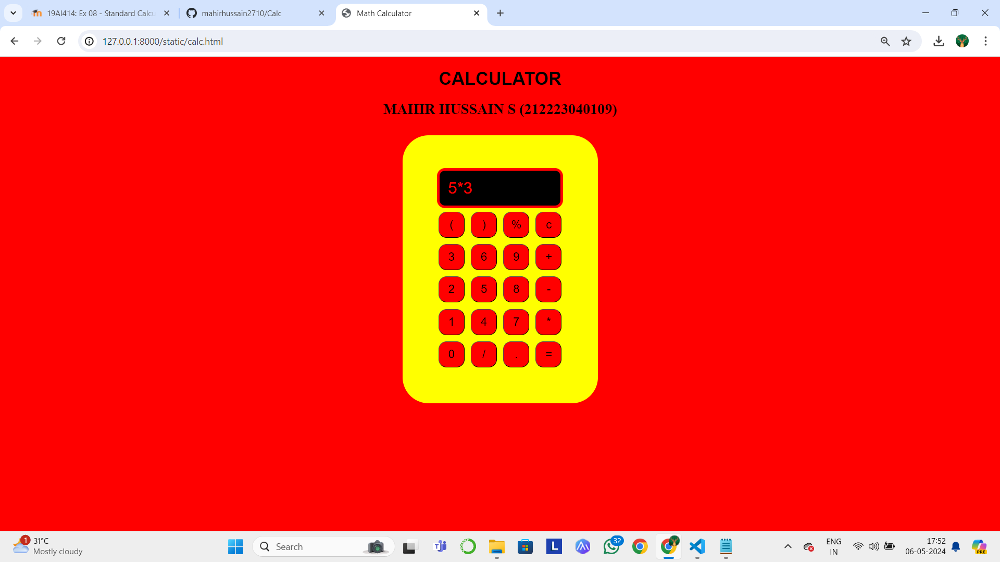

# Ex.08 Design of a Standard Calculator
## Date:06-05-2024

## AIM:
To design a web application for a standard calculator with minimum five operations.

## DESIGN STEPS:

### Step 1:
Clone the github repository and create Django admin interface.

### Step 2:
Change settings.py file to allow request from all hosts.

### Step 3:
Use CSS for creating attractive colors.

### Step 4:
Write JavaScript program for implementing five different operations.

### Step 5:
Validate the HTML and CSS code.

### Step 6:
Publish the website in the given URL.

## PROGRAM :
developed by-
Mahir Hussain S (212223040109)

clac.html
```
<!DOCTYPE html>
<html lang="en">
<head>
    <meta charset="UTF-8">
    <meta name="viewport" content="width=device-width, initial-scale=1.0">
    <meta http-equiv="X-UA-Compatible" content="ie=edge">
    <title>Math Calculator</title>
    <link rel="stylesheet" href="style.css">
</head>
<body bgcolor="RED">
    <div class="container">
        <h1>CALCULATOR</h1>
        <h2 class="text">MAHIR HUSSAIN S (212223040109)</h2><br>

        <div class="calculator">
            <input type="text" name="screen" id="screen">
            <table>
                <tr>
                    <td><button class="color">(</button></td>
                    <td><button class="color">)</button></td>
                    <td><button class="color">%</button></td>
                    <td><button class="color">c</button></td>
                </tr>
                <tr>
                    <td><button>3</button></td>
                    <td><button>6</button></td>
                    <td><button>9</button></td>
                    <td><button class="color">+</button></td>
                </tr>
                <tr>
                    <td><button>2</button></td>
                    <td><button>5</button></td>
                    <td><button>8</button></td>
                    <td><button class="color">-</button></td>
                </tr>
                <tr>
                    <td><button>1</button></td>
                    <td><button>4</button></td>
                    <td><button>7</button></td>
                    <td><button class="color">*</button></td>
                </tr>
                <tr>
                    <td><button>0</button></td>
                    <td><button class="color">/</button></td>
                    <td><button class="color">.</button></td>
                    <td><button class="color">=</button></td>
                </tr>
            </table>
        </div>
    </div>

    <script src="index.js"></script>
</body>
</html>
```
index.js
```
let screen = document.getElementById('screen');
buttons = document.querySelectorAll('button');
let screenValue = '';
for (item of buttons) {
    item.addEventListener('click', (e) => {
        buttonText = e.target.innerText;
        console.log('Button text is ', buttonText);
        if (buttonText == 'X') {
            buttonText = '*';
            screenValue += buttonText;
            screen.value = screenValue;
        }
        else if (buttonText == 'C') {
            screenValue = "";
            screen.value = screenValue;
        }
        else if (buttonText == '=') {
            screen.value = eval(screenValue);
        }
        else {
            screenValue += buttonText;
            screen.value = screenValue;
        }
    })
}
```
style.css
```
.container {
    text-align: center;
    margin-top: 25px;
    
}


.calculator {
    text-align: center;
    border: none;
    background-color: yellow;
    padding: 100px;
    border-radius: 80px;
    display: inline-block;
}

h1 {
    font-size: 55px;
    font-family: Arial, Helvetica, sans-serif;
}

h2 {
    font-size: 45px;
    font-weight: bold;
    color: black;
    text-align: center;
    margin: border;
    margin-top: 25px;
}

input {

    border-radius: 25px;
    border: 8px solid red;
    padding: 25px;
    background: black;
    font-size: 50px;
    height: 55x;
    width: 320px;
    color: red;
}

table {
    margin: auto;
}

button {
    border-radius: 25px;
    border: 15;
    outline: 0px;
    box-shadow: -8px -8px 15px black,  black;
    font-size: 35px;
    background: red;
    color: black;
    width: 80px;
    height: 80px;
    margin: 8px;
    cursor: pointer;
}

.color {
    color: black;
}
```
## OUTPUT:


## RESULT:
The program for designing a standard calculator using HTML and CSS is executed successfully.
